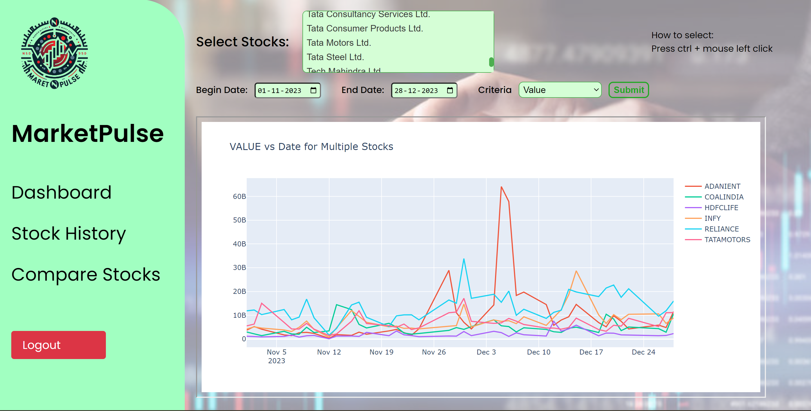

# Trading Analyzer Website

## Overview

The Trading Analyzer website is a platform designed for users to analyze stock data, plot graphs, and access real-time information. The application is built using Flask for the backend, SQLAlchemy for database management, and a combination of HTML, CSS, and JavaScript for the frontend.

## Key Components

### 1. Plotting and Data Retrieval
- **Plotting Functionality**: The `/plot` route allows users to select stock parameters and initiates the plotting functionality.
- **Data Fetching**: Plot data is fetched from the server using the `/api/plot` API endpoint.
- **JavaScript Integration**: JavaScript is used to fetch data and redirect the plot HTML to the same HTML file which has taken inputs.
- **Live Data**: Live stock data is retrieved through the `/api/stock` API endpoints.
- **Comparison Functionality**: The `/compare` route allows users to select multiple stocks and initiates plotting functionality. Live stock data for multiple graphs is retrieved through the `/api/compare` API endpoints.

### 2. Design Decisions
- **Page Navigation**: Created a sidebar for easy navigation across different pages (Dashboard, Stock Graph, Compare Stock).
- **Flask Framework**: Utilized Flask for building the web application due to its lightweight and flexible nature.
- **API Endpoints**: Efficient data exchange between the frontend and backend is facilitated through API endpoints (`/api/plot`, `/api/stock`, `/api/liveData`).
- **Modular Structure**: Multiple Python files are used to ensure `app.py` is solely for routing and remains unaffected by other functions.

### 3. Sidebar
- **Navigation**: The sidebar contains the website logo and options for Dashboard, Stock Graph, and Compare Stock.

### 4. Dashboard Filters
- **Filter Feature**: Added a filter feature on the dashboard to get data of stocks that satisfy specified criteria.
- **Sorting**: Implemented a sort function to sort the list based on user input criteria.
- **Graph Plotting**: Reused the same file for input and graph plotting to avoid creating multiple pages.
- **User Experience**: Added background images and logo for a better user experience.

## Tradeoffs

### 1. Session Persistence
- **Current Session Management**: Limited to the server's runtime. Consider implementing a more robust session management solution for production.

### 2. Live Data
- **Data Storage**: Live data is stored in session storage to avoid fetching it repeatedly, which can be time-consuming.

## Screenshots

1. **Dashboard**: 
2. **Plot Page**: 
3. **Compare Stocks**: 

## Future Considerations

- **User Profile**: Plan to add user profile details and browsing history of stocks.
- **Logout Button**: Plan to add a logout button on the sidebar.
- **Live Data Integration**: Currently using dummy data; plan to add live data for a better user experience.

## Getting Started

### Prerequisites
- Python 3.x
- Flask


## Installation Instructions

1. **Clone the Repository**


2. **Install Required Packages**
- Make sure Python is installed on your system.
- Install the necessary dependencies:
  ```
  pip install -r requirement.txt
  ```

## Usage

To launch the web application, run:
 
  ```
  python3 app.py
  ```

Upon running the command, the Flask server will start, and the application should be accessible through a web browser at `http://localhost:5000` or the designated port displayed in your terminal.


## Project Structure

- `app.py`: Main routing file.
- `static/`: Contains static files (CSS, JavaScript, images).
- `templates/`: Contains HTML templates.
- `include/`: Header files for the project.
- `src/`: Source files with the main application logic.
- `tests/`: Contains testing files.
- `samples/`: Sample E++ and Targ files for reference.

## API Endpoints

- `/api/plot`: Fetch plot data.
- `/api/stock`: Retrieve live stock data.
- `/api/liveData`: Access live data for real-time updates.
- `/api/compare`: Retrieve data for multiple stock comparisons.

## Contributing

1. Fork the repository.
2. Create a new branch (`git checkout -b feature-branch`).
3. Make your changes and commit them (`git commit -m 'Add some feature'`).
4. Push to the branch (`git push origin feature-branch`).
5. Open a pull request.

Feel free to reach out if you have any questions or need further assistance. Happy coding!